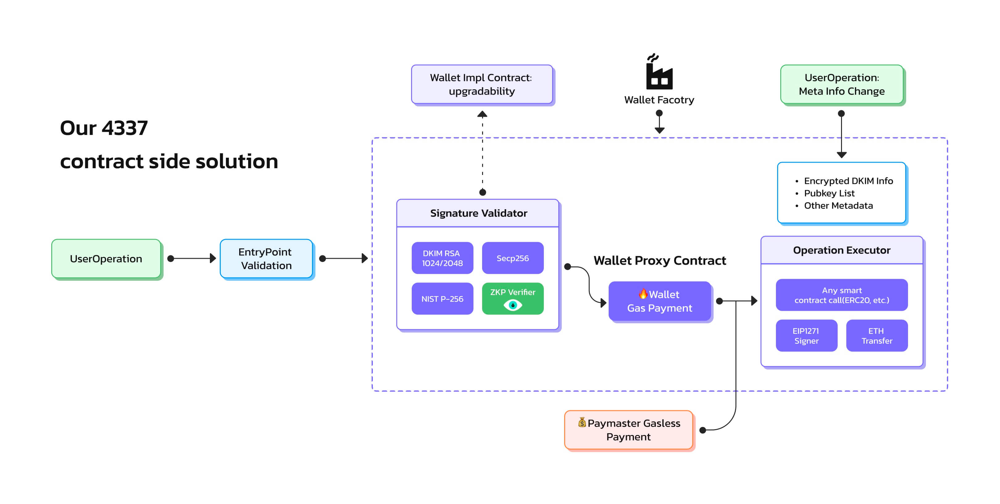

# Overview

Crescent Wallet is a low threshold AA(Account Abstract) wallet based on EIP-4337.Provide a simple and fast blockchain onboarding option for users such as email login，OAuth login，etc.

Crescent has client app that users can use directly, also has SDKs designed for dApp and game developers.

Crescent uses DKIM and ZKP scheme to ensure the security of users' assets while removing seed phrase，private keys. Avoiding the property loss caused by private keys ，seed phrase loss and theft . Allow users to use arbitrary supported tokens to pay for the gas fee and compatible with all mainstream EVM chain.

<figure><figcaption>
Our 4337 contract side solution
</figcaption></figure>
