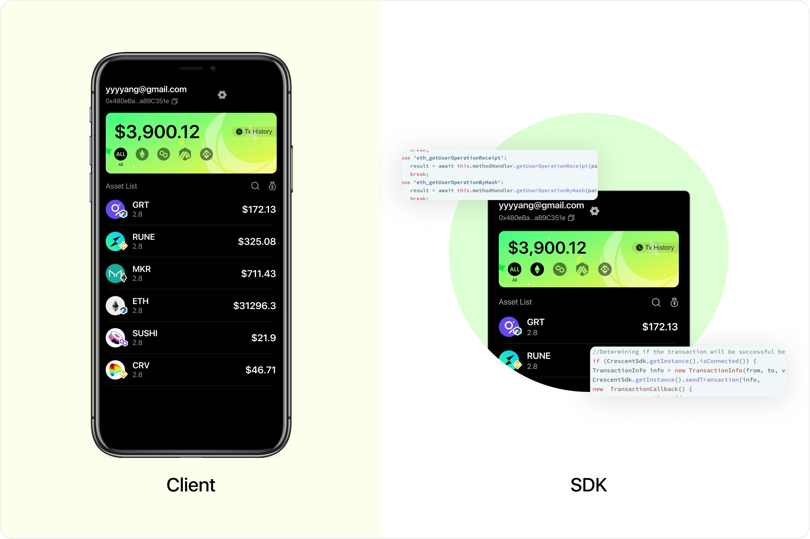

# Overview

Crescent Wallet is an Account Abstract wallet based on EIP-4337, providing a simple and fast blockchain onboarding experience for users. Crescent will provide full web2-style but decentralised login/signup methods based on Ethereum and 4337.

Also, any basic onboarding features like gasless, fiat on/off ramp, AA data explorer, etc., will be included.

Crescent has a client app that users can use directly, and also SDKs designed for dApp and game developers.

<figure><figcaption></figcaption></figure>

## Keyless & Account Recovery

Users log in with email accounts. Seed phrases and private keys are hidden from users' workflow.

Crescent developed a fully decentralised on-chain Email DKIM verification system:

* Users keep control of their blockchain accounts through their emails
* The relationship between email address and blockchain address is completely hidden by ZKP

Crescent will develop more methods to log in such as OAuth, facial recognition, SMS, etc.

## Gasless, frictionless onboarding and more usage&#x20;

Gasless is crucial to the mass adoption of Web3.

As a smart contract wallet that supports EIP 4337 protocol, Paymaster will pay gas for users to achieve a gasless experience when users start a transaction.&#x20;

Paymaster not only supports payment in native tokens for gas but also supports other tokens or payments such as NFT.&#x20;

We provide some basic paymaster templates for different usage and scenarios, which developers can customize, for example:

* Gas-free for users who first use your dApp
* Set up a contract whitelist, when the user interacts with the contract in a whitelist, gas will be paid for the user automatically
* Customize gas policy, provide gas discounts for new users, total free policy and etc.

## Multi-chain support

For now, we support the following chains:

* Ethereum
* Arbitrum
* BSC
* Polygon&#x20;

## Fiat On/Off Ramp Services

We have integrated Transak and more providers will be included later.
