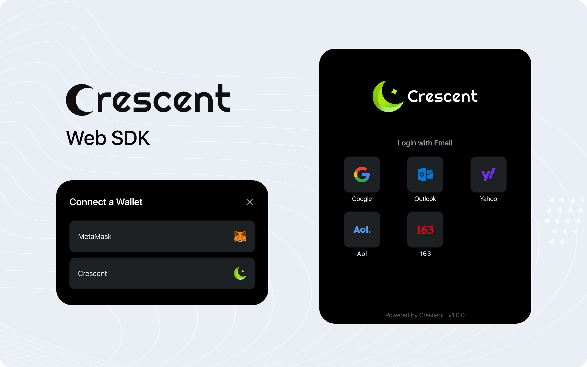

# SDK Integration

## Crescent Wallet SDKs

Crescent Wallet supports multi-platform SDK.&#x20;

| **Platform**                                  | **Status** | **Source**                                                            |
| --------------------------------------------- | ---------- | --------------------------------------------------------------------- |
| [Android SDK](sdk-integration.md#android-sdk) | Done       | [Download](https://github.com/CrescentBase/CrescentDocument/releases) |
| [iOS SDK](sdk-integration.md#ios-sdk)         | Done       | [Download](https://github.com/CrescentBase/CrescentDocument/releases) |
| [Web SDK](sdk-integration.md#web-sdk)         | Done       | [Demo](https://sdk.crescentbase.com/)                                 |
| Unity SDK                                     | Developing | Developing                                                            |

### &#x20;Android SDK

#### **Installation and Usage**

1. Put `crescent-sdk.aar` into the `libs` folder of the project.
2. Initialize the SDK

```javascript
CrescentConfigure config = new CrescentConfigure();
config.style  =  "";  //Custom Styles
config.paymasterUrl = "https://..."; //Paymaster Address
CrescentSdk.getInstance().init(config)；
```

3. Connect wallet

```javascript
CrescentSdk.getInstance().connect(this, new ConnectCallback() {
    @Override
    public void onConnectSuccess(UserInfo info) {
String email = info.email
String address = info.address
    }


	@Override
	    public void onConnectFaill() {
	    }
	});
```

4. Send transaction

```javascript
    // TransactionInfo Related type definition
	public class TransactionInfo {
	    private String chainId;
	    private String to;
	    private String value;
	    private String data;
	}
 
	//Determining if the transaction will be successful before trading
	if (CrescentSdk.getInstance().isConnected()) {
	TransactionInfo info = new TransactionInfo(from, to, value, data);
	CrescentSdk.getInstance().sendTransaction(info, 
	new  TransactionCallback() {
	                 @Override
	                 public void onSendSuccess(TransactioinResult result) {
	String hash = result.hash;
	                 }
	 
	                 @Override
	                 public void onSendFail() {
                      }
	});
	}
```

5. Disconnect wallet

```javascript
CrescentSdk.getInstance().disconnect();
```

### &#x20;iOS SDK

#### **Installation and Usage**

1. Add the `CrescentSDK.framework` to the project.
2. Initialize the SDK

Notes

The Framworks-Libraries, and Embedded Content should be swicth to"Embed\&Sign" on Xcode.

```swift
var config = CrescentConfigure()
     config.style = "" //Custom Styles
     config.paymasterUrl = "https://..." //Paymaster Address
     CrescentSDK.config(configure: config)
```

3. Connect wallet

```swift
CrescentSDK.connect(connectSuccessBlock: { userinfo in
      	 let email = userinfo.email;
         let address = userinfo.address;
     }, connectFailBlock: {
         print("connectFailBlock")
    })
```

4. Send transaction

```swift
var tx = TransactionInfo()
    tx.chainId= ""
    tx.to = ""
    tx.value = ""
    tx.data = "";
    CrescentSDK.sendTransaction(info: tx, sendSuccessBlock: { transactionResult in
    		let hash = transactionResult.hash;
    }, sendFailBlock: {
         print("sendFailBlock")
    })
```

5. Disconnect wallet

```swift
CrescentSDK.disconnect()
```

### Web SDK

<figure><figcaption><p>Crescent Web SDK</p></figcaption></figure>

1. Add js: `https://sdk.crescentbase.com/index.bundle.js`
2. Connect wallet

```javascript
const params = {

    container: element, //parent container

    paymasterUrl: "https://...", //Paymaster Address

    onConnectSuccess: (info) => {

        const email = info.email;

        const address = info.address;

    },

}

CrescentSDK.connect(params);
```

3. Send transaction

```javascript
//Send transaction
const params = {

    container: element, //parent container

    paymasterUrl: "https://...", //Paymaster Address

    onSendSuccess: (txHash) => {

        console.log('txHash: ', txHash)

    },

    tx: {to: '0x0648ceA573a37aD78738c9ED861dD8Ad9Ca53beC', chainId: 137, value: '0x2386f26fc10000'}

}

CrescentSDK.connect(params);
```

4. Logout

```javascript
//Logout
CrescentSDK.logout();
```

5. Fiat OnRamp

```javascript
//fiat OnRamp
const params = {
    walletAddress: '0x0648ceA573a37aD78738c9ED861dD8Ad9Ca53beC'
}
// If using the wallet address of crescent sdk, no parameters are required
CrescentSDK.fiatOnRamp(params); 
```

## General Usage

### Define Your Paymaster

1. Deploy your own Paymaster contract

[DeployedBytecode](https://polygonscan.com/tx/0x2d76d9396f5055b098ed678fd5cfb6c60bb6b9d4e9a74b6c59c4e9cff6776a60) and the corresponding [PaymasterProxy Code](https://github.com/CrescentBase/wallet-4337-contracts/blob/wallet/contracts/wallet/CrescentPaymasterProxy.sol)

2. Deploy the signature server

* Example server URL：https://...

```json
method: POST
Accept: application/json
Content-Type: application/json
Body: { op:{...}, email, public_key, chain_id }
Response: { data:{ .... }  } 
```

* Examples of op and data content

```json
"sender": "0x......6B",
"add_owner": "0x......82",
"nonce": "0x......f0",
"initCode": "0x......12",
"callData": "0x......00",
"callGasLimit": "2000000",
"verificationGasLimit": "1000000",
"preVerificationGas": "21000",
"maxFeePerGas": "1199460050",
"maxPriorityFeePerGas": "1000000000",
"paymasterAndData": "0x...",
"signature": "0x"
```

* Example of signature server

```solidity
//"web3": "^1.3.4",
import Web3 from "web3";
//"ethers": "^5.4.1",
import {ethers} from "ethers";
import {hexConcat} from "ethers/lib/utils";

export async function getPaymasterHash(rpcUrl, paymasterAddress, op) {
    const abi_Paymaster = `
         {
            "inputs": [
                {
                    "components": [
                        {
                            "internalType": "address",
                            "name": "sender",
                            "type": "address"
                        },
                        {
                            "internalType": "uint256",
                            "name": "nonce",
                            "type": "uint256"
                        },
                        {
                            "internalType": "bytes",
                            "name": "initCode",
                            "type": "bytes"
                        },
                        {
                            "internalType": "bytes",
                            "name": "callData",
                            "type": "bytes"
                        },
                        {
                            "internalType": "uint256",
                            "name": "callGasLimit",
                            "type": "uint256"
                        },
                        {
                            "internalType": "uint256",
                            "name": "verificationGasLimit",
                            "type": "uint256"
                        },
                        {
                            "internalType": "uint256",
                            "name": "preVerificationGas",
                            "type": "uint256"
                        },
                        {
                            "internalType": "uint256",
                            "name": "maxFeePerGas",
                            "type": "uint256"
                        },
                        {
                            "internalType": "uint256",
                            "name": "maxPriorityFeePerGas",
                            "type": "uint256"
                        },
                        {
                            "internalType": "bytes",
                            "name": "paymasterAndData",
                            "type": "bytes"
                        },
                        {
                            "internalType": "bytes",
                            "name": "signature",
                            "type": "bytes"
                        }
                    ],
                    "internalType": "struct UserOperation",
                    "name": "userOp",
                    "type": "tuple"
                }
            ],
            "name": "getHash",
            "outputs": [
                {
                    "internalType": "bytes32",
                    "name": "",
                    "type": "bytes32"
                }
            ],
            "stateMutability": "view",
            "type": "function"
        }

    const provider = new ethers.providers.JsonRpcProvider(rpcUrl);
    const contract = new ethers.Contract(paymasterAddress, abi_Paymaster, provider);
    return await contract.getHash(op);
}


export function sign(hash, privateKey) {
    const signature = new Web3().eth.accounts.sign(hash, privateKey);
    return signature.signature;
}


export async function test() {
    const op = { ... };
    // privateKey is the corresponding private key of the EOA that deployed Paymaster contract
    const privateKey = "....";
    //target chain url
    const rpcUrl = "...";
    //your paymaster address
    const paymaster = "0x...";
    //Get hash by paymaster contract
    const hash = await getPaymasterHash(rpcUrl, paymaster, op);
    //Concat paymaster and sign hash
    op.paymasterAndData = hexConcat([paymaster, sign(hash, privateKey)]);
    return op;
}

```

3. Stake and deposit to obtain gas payment authorization

* Stake and Unstake

To gain authorization for gas payment, paymaster needs to stake a certain amount of cryptocurrency to EntryPoint. The minimum amount for staking is 0.01 units of the native currency of the corresponding blockchain.

You can unstake and retrieve your staked tokens at any time. To do so, simply call `unstake`. After 100 seconds, your staked tokens will be unlocked and available for retrieval. Please note that if you unstake, paymaster will lose its authorization to pay for gas.

* Gas deposit and withdraw

Gas fees for user transactions will be deducted from the deposit. Paymaster needs to call `deposit` to store coins/tokens before paying for gas. You can withdraw them from the deposit at any time by calling 'withdraw'. Use `getDeposit` to check the amount of deposit.

* Example of Stake and Deposit

```solidity
import {ethers} from "ethers";
const paymasterABI = [
    {
        "inputs": [
            {
                "internalType": "uint32",
                "name": "extraUnstakeDelaySec",
                "type": "uint32"
            }
        ],
        "name": "addStake",
        "outputs": [],
        "stateMutability": "payable",
        "type": "function"
    },
    {
        "inputs": [],
        "name": "unlockStake",
        "outputs": [],
        "stateMutability": "nonpayable",
        "type": "function"
    },
    {
        "inputs": [
            {
                "internalType": "address payable",
                "name": "withdrawAddress",
                "type": "address"
            }
        ],
        "name": "withdrawStake",
        "outputs": [],
        "stateMutability": "nonpayable",
        "type": "function"
    },
    {
        "inputs": [],
        "name": "deposit",
        "outputs": [],
        "stateMutability": "payable",
        "type": "function"
    },
    {
        "inputs": [
            {
                "internalType": "address payable",
                "name": "withdrawAddress",
                "type": "address"
            },
            {
                "internalType": "uint256",
                "name": "amount",
                "type": "uint256"
            }
        ],
        "name": "withdrawTo",
        "outputs": [],
        "stateMutability": "nonpayable",
        "type": "function"
    },
    {
        "inputs": [],
        "name": "getDeposit",
        "outputs": [
            {
                "internalType": "uint256",
                "name": "",
                "type": "uint256"
            }
        ],
        "stateMutability": "view",
        "type": "function"
    }
];


export async function addStake(provider, paymasterAddress, privateKey) {
    const wallet = new ethers.Wallet(privateKey, provider);
    const paymasterStake = ethers.utils.parseEther('0.01');


    const contract = new ethers.Contract(paymasterAddress, paymasterABI, wallet);
    try {
        const txAddStake = await contract.addStake(0, { value: paymasterStake });
        await txAddStake.wait();
    } catch {}
}


export async function unlockStake(provider, paymasterAddress, privateKey) {
    const wallet = new ethers.Wallet(privateKey, provider);
    const contract = new ethers.Contract(paymasterAddress, paymasterABI, wallet);
    try {
        const txUnlockStake = await contract.unlockStake();
        await txUnlockStake.wait();
    } catch {}
}


export async function withdrawStake(provider, paymasterAddress, privateKey, withdrawAddress) {
    const wallet = new ethers.Wallet(privateKey, provider);
    const contract = new ethers.Contract(paymasterAddress, paymasterABI, wallet);
    try {
        const txWithdrawStake = await contract.withdrawStake(withdrawAddress);
        await txWithdrawStake.wait();
    } catch {}
}


export async function deposit(provider, paymasterAddress, privateKey, ether) {
    const wallet = new ethers.Wallet(privateKey, provider);
    const depositEther = ethers.utils.parseEther(ether);


    const contract = new ethers.Contract(paymasterAddress, paymasterABI, wallet);
    try {
        const txDeposit = await contract.deposit({ value: depositEther });
        await txDeposit.wait();
    } catch {}
}


export async function getDeposit(provider, paymasterAddress) {
    const contract = new ethers.Contract(paymasterAddress, paymasterABI, provider);
    try {
        return await contract.getDeposit();
    } catch {}
    return undefined;
}


export async function withdrawTo(provider, paymasterAddress, privateKey, withdrawAddress, amount) {
    const wallet = new ethers.Wallet(privateKey, provider);
    const contract = new ethers.Contract(paymasterAddress, paymasterABI, wallet);


    try {
        const txWithdrawTo = await contract.withdrawTo(withdrawAddress, amount);
        await txWithdrawTo.wait();
    } catch {}
}


export async function example() {
    //The node address corresponding to the chain.
    const rpc = "rpc url";
    const provider = new ethers.providers.JsonRpcProvider(rpc);


    //your paymaster address
    const paymasterAddress = "0x...";
    //The private key that you use to addStake.
    const privateKey = "...";


    //stake
    await addStake(provider, paymasterAddress, privateKey);


    //Staking on-demand, the unit of staked tokens is wei.
    const ether = "1";


    //deposit
    await deposit(provider, paymasterAddress, privateKey, ether);


    //getDeposit
    await getDeposit(provider, paymasterAddress);
}
```

4. SDK call example

&#x20;refer to [Initialize the SDK](sdk-integration.md#installation-and-usage)

```
config.paymasterUrl = "https://..."; //Paymaster Address
```

### Customise  UI

Crescent provides a full-featured UI customisation ability. Please reference the following doc.


[sdk-ui-doc.md](sdk-ui-doc.md)


##

&#x20;

&#x20;

&#x20;

&#x20;
