# SDK UI Doc

## Overview&#x20;

To ensure visual consistency, we use a specific color palette to define colors and provide a consistent visual experience for the products you build. This color palette can be used to efficiently adjust the appearance of components or create your own themes to meet diverse visual needs for business and branding, including but not limited to global styles (colors, images). We provide black-and-white preset themes by default, and you can quickly generate different styles of themes by modifying parameters.

## Design Guidelines 

### Black Theme 

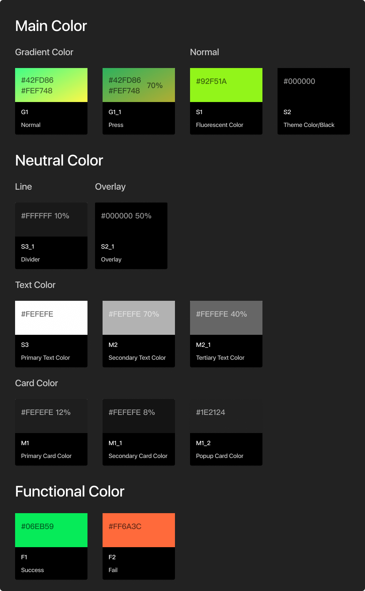

### White Theme 

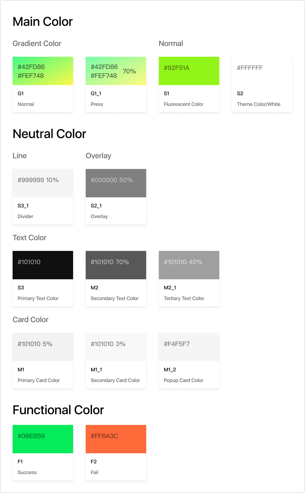

### Common components for Black and White Theme&#x20;

#### Colors remain unchanged when switching themes

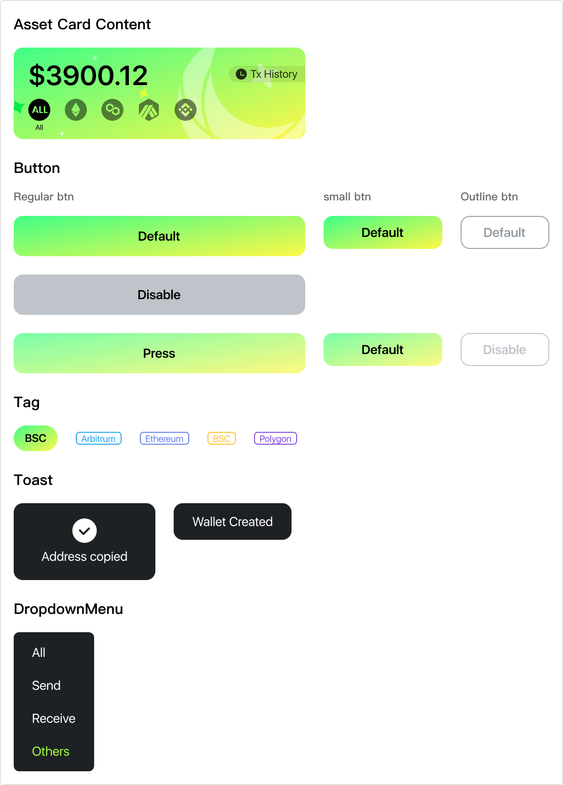

#### Common slices for Black and White Theme

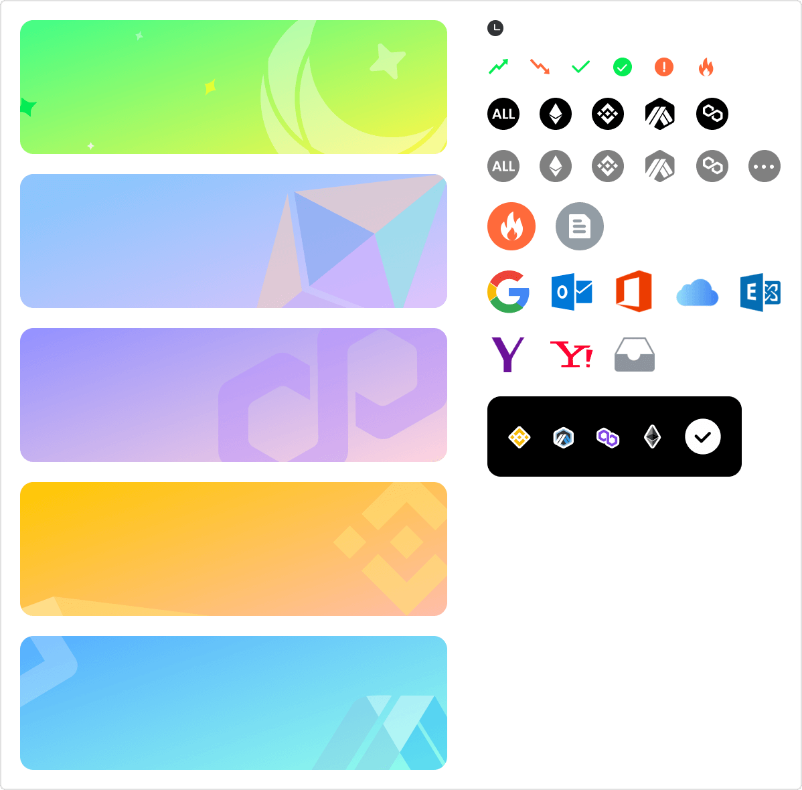

#### Non-Common slices for Black and White Theme 

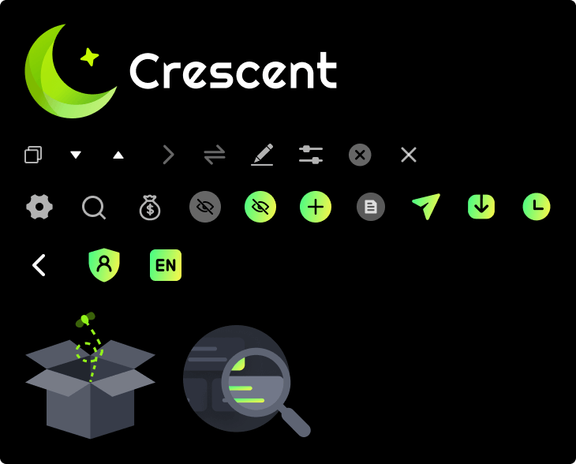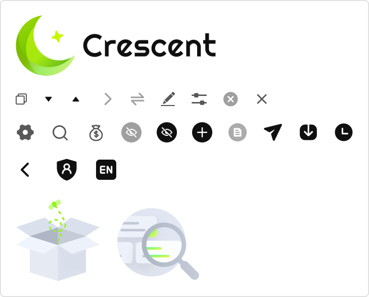

#### Special Cases 

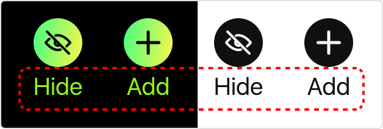

## Custom Themes 

Choose a White or Black Theme for customization according to your brand style. You can customize all the following colors and modify the listed images to achieve a uniform brand style.

### General modification 

#### **Color**

Brand Color

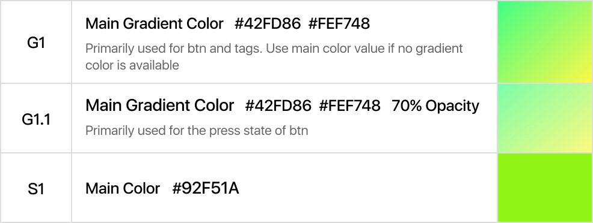

Functional Color

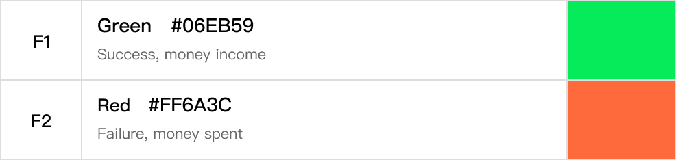

Images

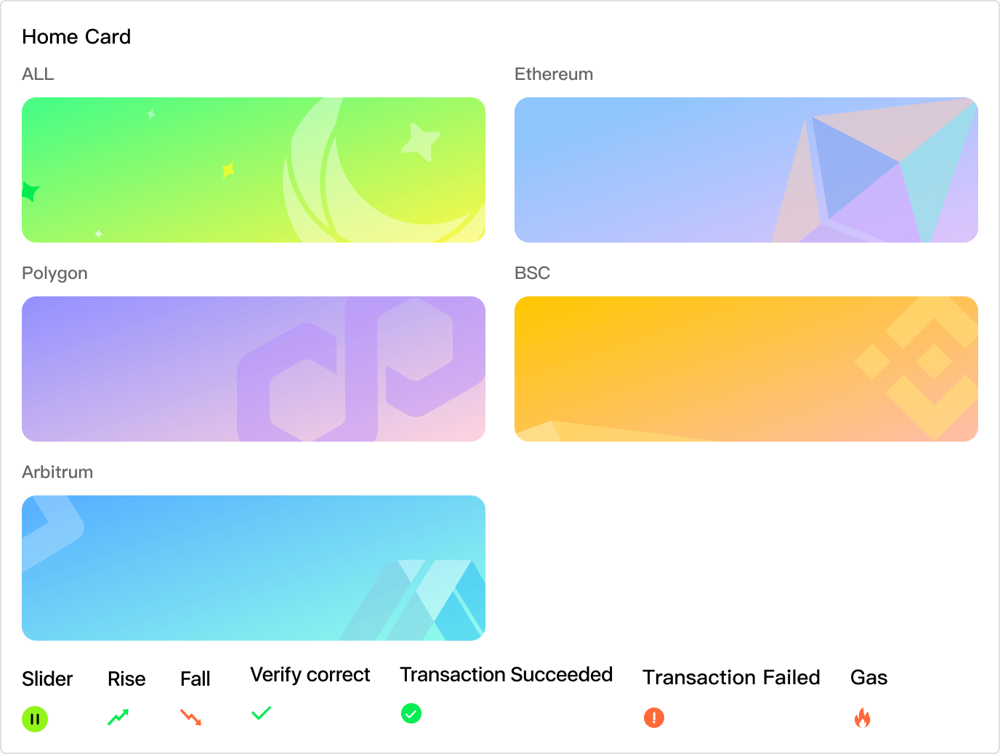

Loading

### Modification based on Black Theme 

#### **Color**

Theme Color

#### **Neutral Color**

Text Color

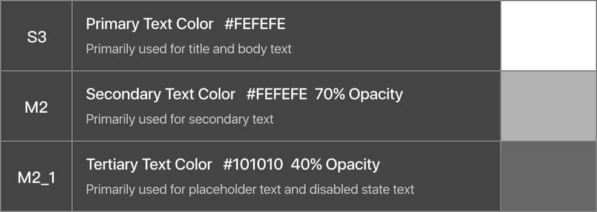

Card Color

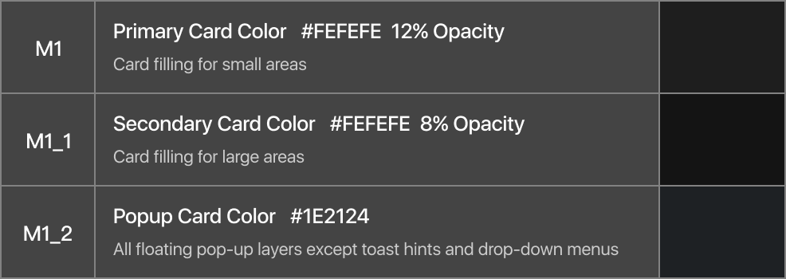

#### **Images**

Logo

Icon

Empty State

### Modification based on White Theme 

#### **Color**

Theme Color

#### **Neutral Color**

Text Color

.png>)

Card Color

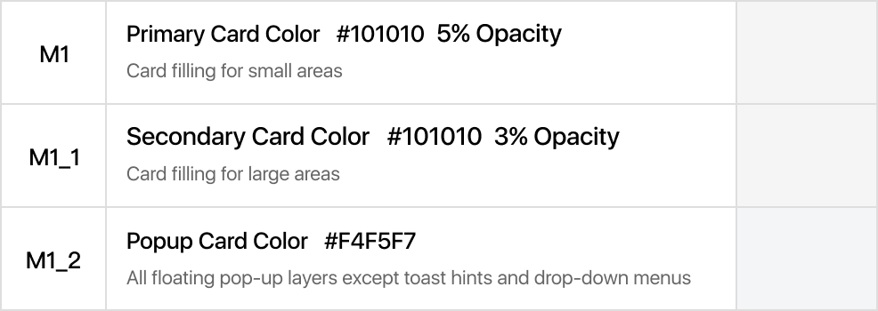

#### **Images**

Logo

Icon

.png>)

Empty Placeholder

.png>)

****
