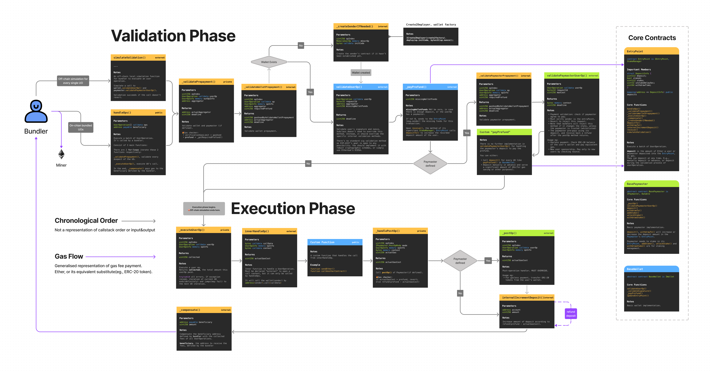
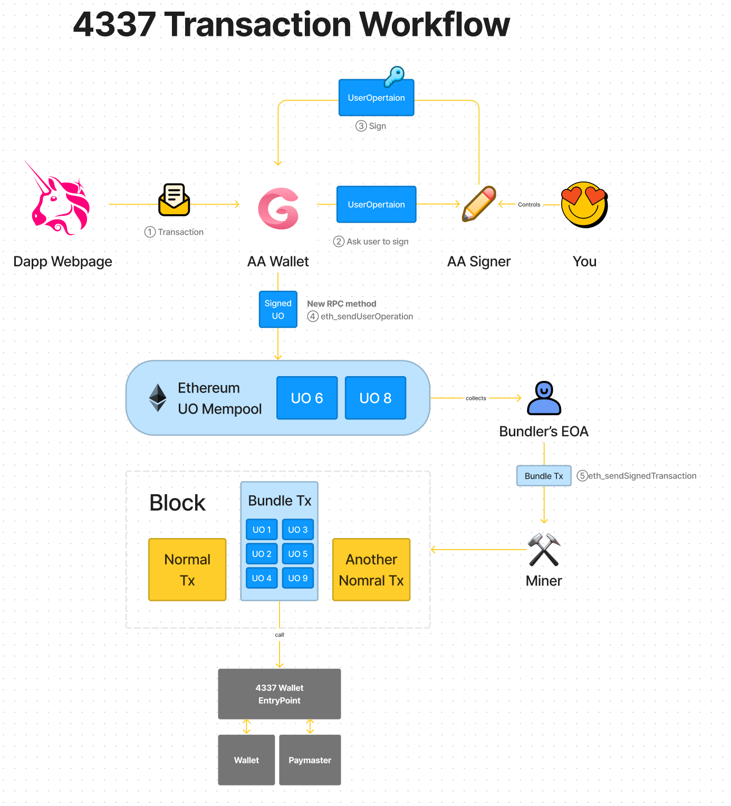

# Technical Architecture

Crescent is an open-source wallet, and this chapter provides an analysis of the wallet's basic infrastructure for research and learning purposes.&#x20;

Note that it's not required to read this chapter to integrate Crescent SDK.

## Bundler

Bundler packs all UserOperation(UOs) into a normal tx.

<figure><figcaption><p>Bundler &#x26; 4337 Transaction</p></figcaption></figure>

The Bundler calls EntryPoint to package user transactions, validates UserOperation (UO) off-chain, removes UOs that do not meet requirements or have issues, packages compliant UOs and submits them to the blockchain.&#x20;

Main features include:

* eth\_sendUserOperation：send transactions.
* eth\_estimateUserOperationGas：gas evaluation.
* eth\_getUserOperationReceipt：Get transaction history.

```solidity
async handleMethod(method, params) {
        let result;
        switch (method) {
            case 'eth_chainId':
                // eslint-disable-next-line no-case-declarations
                const { chainId } = await this.provider.getNetwork();
                result = chainId;
                break;
            case 'eth_supportedEntryPoints':
                result = await this.methodHandler.getSupportedEntryPoints();
                break;
            case 'eth_sendUserOperation':
                result = await this.methodHandler.sendUserOperation(params[0], params[1]);
                break;
            case 'eth_estimateUserOperationGas':
                result = await this.methodHandler.estimateUserOperationGas(params[0], params[1]);
                break;
            case 'eth_getUserOperationReceipt':
                result = await this.methodHandler.getUserOperationReceipt(params[0]);
                break;
            case 'eth_getUserOperationByHash':
                result = await this.methodHandler.getUserOperationByHash(params[0]);
                break;
            case 'web3_clientVersion':
                result = this.methodHandler.clientVersion();
                break;
            default:
                throw new utils_2.RpcError(`Method ${method} is not supported`, -32601);
        }
        return result;
    }
```

## &#x20;EntryPoint Contract

EntryPoint is the core entry point for all functionalities. Each project deploys their own EntryPoint. Bundler, Wallet, and Paymaster all need to work around EntryPoint.

EntryPoint, Paymaster, and Wallet contracts work in accord.

<figure><figcaption><p>Workflow of 4337 contracts</p></figcaption></figure>

Main features include:

* simulateValidation：Simulate user transactions and validate UO off-chain.

```solidity
    function simulateValidation(UserOperation calldata userOp) external returns (uint256 preOpGas, uint256 prefund) {
        uint256 preGas = gasleft();


        bytes32 requestId = getRequestId(userOp);
        (prefund,,) = _validatePrepayment(0, userOp, requestId);
        preOpGas = preGas - gasleft() + userOp.preVerificationGas;


        require(msg.sender == address(0), "must be called off-chain with from=zero-addr");
    }
```

* handleOPs：Package compliant UOs and submit them on-chain.

```solidity
    function handleOps(UserOperation[] calldata ops, address payable beneficiary) public {

        uint256 opslen = ops.length;
        UserOpInfo[] memory opInfos = new UserOpInfo[](opslen);
}
```

It will create a new wallet for the user according to EIP-2470 if the user's wallet address has not been created.

## &#x20;Paymaster Contract

Paymaster has the following functions and features：

* Pay gas fees to EntryPoint.
* Only respond to messages from EntryPoint.
* Confirm the intention to EntryPoint that pay for a certain UO.
* stake in EntryPoint to become a paymasterer；

Note: Only after passing the validation of validatePaymasterUserOp, Paymaster will pay for users.

```solidity
function validatePaymasterUserOp(UserOperation calldata userOp, bytes32 requestId, uint256 maxCost) external view returns (bytes memory context);
```

### &#x20;PaymasterProxy Contract

The main contract of Paymaster，responsible for upgrading Paymaster contract.

```solidity
    function upgradeDelegate(address newImplementation) public {
        require(msg.sender == _getAdmin());
        _upgradeTo(newImplementation);
    }
```

## Wallet Contracts

Crescent wallet contracts use proxy contract architecture.&#x20;

There are three wallet contracts:

* Wallet: Implementation contract.
* WalletProxy: Proxy contract. Proxy has the ability to upgrade to the latest implementation automatically, which is disabled by default.
* WalletController: A controller defines the latest Implementation address.

### Wallet Contract

The implementation contract of WalletProxy, delegates the following functions:

* Pay gas fees to EntryPoint.
* Only respond to messages from EntryPoint.
* Execute specific transaction contents from EntryPoint.
* addOwner: add a user device after passing DKIM verification.

```solidity
function addOwner(
        address owner,
        VerifierInfo calldata info
    ) external onlyEntryPoint {
        bytes memory modulus = dkimManager.dkim(info.ds);
        require(modulus.length != 0, "Not find modulus!");
        require(IVerifier(dkimVerifier).verifier(owner, modulus, info), "Verification failed!");
        require(allOwner.length < type(uint16).max, "Too many owners");
        uint16 index = uint16(allOwner.length + 1);
        allOwner.push(owner);
        owners[owner] = index;
    }
```

* `_validateSignature()`: Verify if the signature is valid, and only proceed with subsequent operations if it is.

```solidity
 function _validateSignature(UserOperation calldata userOp, bytes32 requestId) internal view override {
        //0x350bddaa addOwner
        bool isAddOwner = bytes4(userOp.callData) == 0x350bddaa;
        if (userOp.initCode.length != 0 && !isAddOwner) {
            revert("wallet: not allow");
        }


        if (!isAddOwner) {
            bytes32 hash = requestId.toEthSignedMessageHash();
            address signatureAddress = hash.recover(userOp.signature);
            require(owners[signatureAddress] > 0, "wallet: wrong signature");
        }
    }
```

### &#x20;**WalletProxy** Contract

Proxy has the ability to upgrade to the latest implementation automatically, which is disabled by default to avoid any kind of malicious attack from any side including us.

```solidity
    // Manually upgrade to new impl
    function upgradeDelegate(address newDelegateAddress) public {
        require(msg.sender == _getAdmin());
        _upgradeTo(newDelegateAddress);
    }

    // Toggle auto update feature. The default value is false.
    function setAutoUpdateImplementation(bool value) public {
        require(msg.sender == _getAdmin());
        StorageSlot.getBooleanSlot(_AUTO_UPDATE_SLOT).value = value;
    }
```

### **WalletController** Contract

A controller defines the latest Implementation address. Wallet in the following situations will set `implementation` address according to this controller:

* A newly created wallet
* An existing wallet with auto-update enabled

```solidity
    function setImplementation(address _implementation) public onlyOwner {
        implementation = _implementation;
    }
```

## DKIM ZKP Verification

### What's DKIM?

Domainkeys Identified Mail (DKIM) is an email authentication method designed to detect whether the sender address, subject, body, etc. of an email has been modified (email spoofing) .The mail will be signed by the sender's mail service provider when outrebounding. After the mail-receiving server receives the DKIM-signed mail, it can verify whether the mail is indeed from the sender and whether the content has not been tampered with.&#x20;

By clicking "View Original" or "View Source" in any email client, you can directly view the .eml files which include the DKIM-Signature field. (For more details, please refer to the [DKIM\_WIKI](https://en.wikipedia.org/wiki/DomainKeys\_Identified\_Mail).)

> DKIM-Signature: v=1; a=rsa-sha256; c=relaxed/relaxed; d=foxmail.com;
>
> s=s201512; t=1670419235;
>
> bh=9RqYI6fxZOUZAYcxZV4SvznReZm2Mn7vMx5y5+asYAM=;
>
> h=From:To:Subject:Date;
>
> b=A3Kfzk0KcOfQhiEGJZ5KUpb3ItszuNBCSJ08hhgaGUIuglV4QaTm9BVH9pDmljKl+AIzS4nRZjYFLiRQWN8ZaYh7edwCp7BAV2l2ei27+mlP/7nsCapEFdbM1cyNBoR8lGwJMkMh3HGhCPMLH8c2GQVx5GxdOj+NLVQZGNVrHwk=

* v: DKIM version.
* a: Cryptographic algorithm used for the signature.
* c: Standardization algorithm for the email header and body, divided into simple and relaxed. The standardization algorithm is a way to handle spaces, carriage returns, line feeds, and other content.
* d: Domain of the sender's service provider.
* s: Selector, customized by the sender's service provider. Multiple selectors can correspond to a single domain. One selector corresponds to a pair of public and private keys. The public key corresponding to domain+selector can be obtained by querying the DNS server.
* t: UNIX timestamp.
* bh: Body hash, the hash of the body encoded in base64
* h: Header fields that are signed, chosen by the sender's service provider
* b: Signature encoded in base64

We implemented DKIM system on-chain with ZKP to verify email and maintain privacy.

### DKIM Canonical Record Contract

Used to record DKIM-related data, such as pubkey, domain and selector.

```solidity
contract DKIMManager is Ownable {


    mapping (bytes => bytes) private allDkim;


    constructor() {}

    // Write new DKIM data
    function upgradeDKIM(bytes memory name, bytes memory _dkim) public onlyOwner {
        allDkim[name] = _dkim;
    }

    // Get DKIM data
    function dkim(bytes memory name) public view returns (bytes memory) {
        return allDkim[name];
    }


}
```

### DKIM Verifier Contract

All ZKP, cryptographic and verification functions are in this contract. Operations such as adding a new pub key for a wallet, require calling this contract to be verified. Verification success proves that the action was initiated by the account owner's email.

We divided the verifier into plain solidity verifier and ZKP solidity verifier.

<figure><figcaption></figcaption></figure>

All parameters go through this `verifier` function. `verifyProof` will call the ZKP verifier and the rest are plain solidity logic.

```solidity
   function verifier(
        address publicKey,
        bytes memory modulus,
        VerifierInfo calldata info
    ) external view returns (bool)  {
        uint[] memory input = getInput(info.hmua, info.bh, info.base);
        //ZKP Verifier
        if (!verifyProof(info.a, info.b, info.c, input)) {
            return false;
        }
        //bh(bytes) == base64(sha1/sha256(Canon-body))
        if (!equalBase64(info.bh, info.body)) {
            return false;
        }
        //Operation ∈ Canon-body
        if (!containsAddress(publicKey, info.body)) {
            return false;
        }
        //b == RSA(base)
        if (!sha256Verify(info.base, info.rb, info.e, modulus)) {
            return false;
        }
        return true;
    }
```

Full details, circuits, desgin rationale see [https://github.com/CrescentBase/DKIM-Example](https://github.com/CrescentBase/DKIM-Example).
