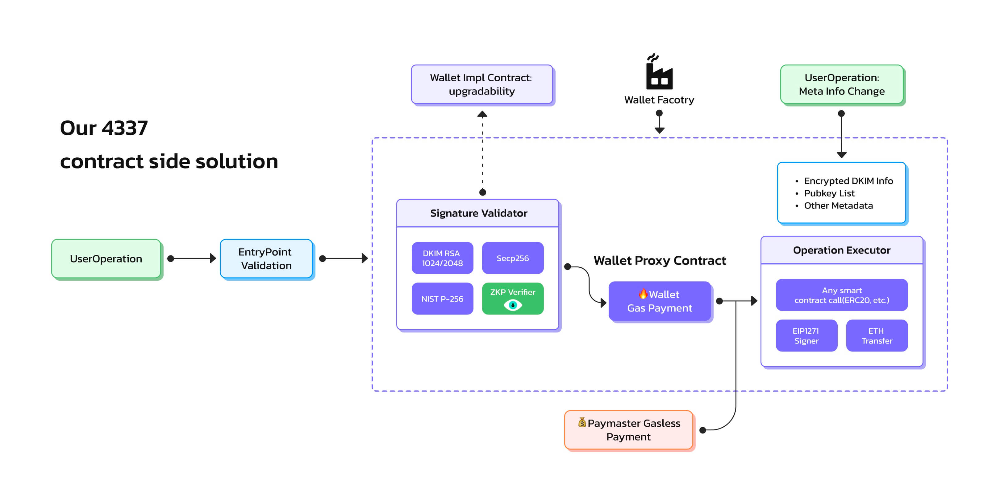

# Technical Architecture

Crescent is an open-source wallet, and this chapter provides an analysis of the wallet's basic infrastructure for research and learning purposes.&#x20;

Note that it's not required to read this chapter to integrate Crescent SDK.

## Bundler

Bundler packs all UserOperations(UOs) into a normal tx.

<figure><figcaption></figcaption></figure>

The Bundler calls EntryPoint to package user transactions, validates UserOperation (UO) off-chain, removes UOs that do not meet requirements or have issues, packages compliant UOs and submits them to the blockchain.&#x20;

Main features include:

* eth\_sendUserOperation：Send transactions.
* eth\_estimateUserOperationGas：Gas evaluation.
* eth\_getUserOperationReceipt：Get transaction history.

```solidity
async handleMethod(method, params) {
        let result;
        switch (method) {
            case 'eth_chainId':
                // eslint-disable-next-line no-case-declarations
                const { chainId } = await this.provider.getNetwork();
                result = chainId;
                break;
            case 'eth_supportedEntryPoints':
                result = await this.methodHandler.getSupportedEntryPoints();
                break;
            case 'eth_sendUserOperation':
                result = await this.methodHandler.sendUserOperation(params[0], params[1]);
                break;
            case 'eth_estimateUserOperationGas':
                result = await this.methodHandler.estimateUserOperationGas(params[0], params[1]);
                break;
            case 'eth_getUserOperationReceipt':
                result = await this.methodHandler.getUserOperationReceipt(params[0]);
                break;
            case 'eth_getUserOperationByHash':
                result = await this.methodHandler.getUserOperationByHash(params[0]);
                break;
            case 'web3_clientVersion':
                result = this.methodHandler.clientVersion();
                break;
            default:
                throw new utils_2.RpcError(`Method ${method} is not supported`, -32601);
        }
        return result;
    }
```

## EntryPoint Contract

EntryPoint: Is the core entry point for all functionalities. Each project deploys its own EntryPoint. Bundler, Wallet, and Paymaster all need to work with EntryPoint.

EntryPointController: The controller is used to specify the address of the latest EntryPoint contract.

### EntryPoint

<figure><figcaption><p>Crescent 4337 Contracts Architecture</p></figcaption></figure>

EntryPoint, Paymaster, and Wallet contracts work in accord.

<figure><figcaption><p>Workflow of 4337 contracts</p></figcaption></figure>

Main features include:

* simulateValidation：Simulate user transactions and validate UO off-chain.

```solidity
    function simulateValidation(UserOperation calldata userOp) external {
        UserOpInfo memory outOpInfo;
        
        _simulationOnlyValidations(userOp);
        (uint256 validationData, uint256 paymasterValidationData) = _validatePrepayment(0, userOp, outOpInfo);
        StakeInfo memory paymasterInfo = _getStakeInfo(outOpInfo.mUserOp.paymaster);
        StakeInfo memory senderInfo = _getStakeInfo(outOpInfo.mUserOp.sender);
        StakeInfo memory factoryInfo;
        {
            bytes calldata initCode = userOp.initCode;
            address factory = initCode.length >= 20 ? address(bytes20(initCode[0 : 20])) : address(0);
            factoryInfo = _getStakeInfo(factory);
         }

```

* handleOPs：Package compliant UOs and submit them on-chain.

```solidity
    function handleOps(UserOperation[] calldata ops, address payable beneficiary) public nonReentrant {

        uint256 opslen = ops.length;
        UserOpInfo[] memory opInfos = new UserOpInfo[](opslen);
}
```

It will create a new wallet for the user according to EIP-2470 if the user's wallet address has not been created.

### EntryPointController

The controller is used to specify the address of the latest EntryPoint contract.

Main features include:

* setEntryPoint: Specifies the address of the latest EntryPoint contract.

```solidity
   function setEntryPoint(address _entryPoint) public onlyOwner {
        require(_entryPoint != address(0), "invalid entryPoint");
        emit EntryPointChanged(entryPoint, _entryPoint);
        
        entryPoint = _entryPoint;
}
```

* getEntryPoint：Get the current EntryPoint contract address.

```solidity
    function getEntryPoint() public view returns (address) {
        return entryPoint;
    }
```

## Paymaster Contract

Paymaster is a contract for gasless or customised payment for your users. It should be deployed by yourself to match your business. We will facilitate the coding and deployment of your Paymaster if you need.

Paymaster has the following functions and features：

* Pay gas fees to EntryPoint.
* Only respond to messages from EntryPoint.
* Confirm the intention to EntryPoint that pay for a certain UO.
* Stake in EntryPoint to become a Paymaster.
* Transfer the desired asset to your Paymaster as funds to pay for UOs.
* Only after passing the validation of `validatePaymasterUserOp`, Paymaster will pay for users.  Validation is achieved by the preset pubkey set by `constructor` or `setVerifyingSigner()`. The corresponding private key **normally should be stored in your centralised server**, to check and sign paymaster UOs.
* You can also customise any kind of Paymaster as you want.

### Proxy Architecture

Paymaster is upgradeable because of its proxy design.

```solidity
    function upgradeDelegate(address newImplementation) public {
        require(msg.sender == _getAdmin());
        _upgradeTo(newImplementation);
    }
```

## Wallet Contracts

Crescent wallet contracts use **triple proxy contract** architecture, which ensures:

* Upgradability of the users' wallet contract
* Decentralisation, a user can decide whether to upgrade his wallet contract

There are three wallet contracts:

* Wallet: Implementation contract.
* WalletProxy: Proxy contract. Proxy has the ability to upgrade to the latest implementation automatically, which is disabled by default.
* WalletController: A controller defines the latest Implementation address.

### Wallet Contract

The implementation contract of WalletProxy, delegates the following functions:

* Pay gas fees to EntryPoint.
* Only respond to messages from EntryPoint.
* Execute specific transaction contents from EntryPoint.
* addOwner: Add a user device after passing DKIM verification.

```solidity
    function addOwner(
        address owner,
        VerifierInfo calldata info
    ) external onlyEntryPoint {
        require(allOwner.length < type(uint16).max, "Too many owners");
        require(owners[owner] == 0, "Owner already exists");
        IVerifier(dkimVerifier).verifier(owner, hmua, info);
        uint16 index = uint16(allOwner.length + 1);
        allOwner.push(owner);
        owners[owner] = index;
    }

```

* `_validateSignature()`: Verify if the signature is valid, and only proceed with subsequent operations if it is.

```solidity
    function _validateSignature(UserOperation calldata userOp, bytes32 userOpHash)
    internal override virtual returns (uint256 validationData) {
        bool isAddOwner = bytes4(userOp.callData) == this.addOwner.selector;
        if (userOp.initCode.length != 0 && !isAddOwner) {
            // revert("wallet: not allow");
            return SIG_VALIDATION_FAILED;
        }

        if (!isAddOwner) {
            bytes32 hash = userOpHash.toEthSignedMessageHash();
            address signatureAddress = hash.recover(userOp.signature);
            if (owners[signatureAddress] <= 0) {
                return SIG_VALIDATION_FAILED;
            }
        }
        return 0;
    }
```

### &#x20;**WalletProxy** Contract

Proxy has the ability to upgrade to the latest implementation automatically, which is disabled by default to avoid any kind of malicious attack from any side including us.

```solidity
     // Manually upgrade to new impl
    function upgradeDelegate(address newDelegateAddress) public {
        require(msg.sender == getEntryPoint());
        _upgradeTo(newDelegateAddress);
    }

    // Toggle auto update feature. The default value is false.
    function setAutoUpdateImplementation(bool value) public {
        require(msg.sender == getEntryPoint());
        StorageSlot.getBooleanSlot(_AUTO_UPDATE_SLOT).value = value;
    }
```

### **WalletController** Contract

A controller defines the latest Implementation address. Wallet in the following situations will set `implementation` address according to this controller:

* A newly created wallet.
* An existing wallet with auto-update enabled.

```solidity
    function setImplementation(address _implementation) public onlyOwner {
        require(_implementation != address(0), "invalid implementation");
        implementation = _implementation;
    }

```

## DKIM ZKP Verification

### What's DKIM?

Domainkeys Identified Mail (DKIM) is an email authentication method designed to detect whether the sender address, subject, body, etc. of an email has been modified (email spoofing) .The mail will be signed by the sender's mail service provider when outrebounding. After the mail-receiving server receives the DKIM-signed mail, it can verify whether the mail is indeed from the sender and whether the content has not been tampered with.&#x20;

By clicking "View Original" or "View Source" in any email client, you can directly view the .eml files which include the DKIM-Signature field. (For more details, please refer to the [DKIM\_WIKI](https://en.wikipedia.org/wiki/DomainKeys\_Identified\_Mail).)

> DKIM-Signature: v=1; a=rsa-sha256; c=relaxed/relaxed; d=foxmail.com;
>
> s=s201512; t=1670419235;
>
> bh=9RqYI6fxZOUZAYcxZV4SvznReZm2Mn7vMx5y5+asYAM=;
>
> h=From:To:Subject:Date;
>
> b=A3Kfzk0KcOfQhiEGJZ5KUpb3ItszuNBCSJ08hhgaGUIuglV4QaTm9BVH9pDmljKl+AIzS4nRZjYFLiRQWN8ZaYh7edwCp7BAV2l2ei27+mlP/7nsCapEFdbM1cyNBoR8lGwJMkMh3HGhCPMLH8c2GQVx5GxdOj+NLVQZGNVrHwk=

* v: DKIM version.
* a: Cryptographic algorithm used for the signature.
* c: Standardization algorithm for the email header and body, divided into simple and relaxed. The standardization algorithm is a way to handle spaces, carriage returns, line feeds, and other content.
* d: Domain of the sender's service provider.
* s: Selector, customized by the sender's service provider. Multiple selectors can correspond to a single domain. One selector corresponds to a pair of public and private keys. The public key corresponding to domain+selector can be obtained by querying the DNS server.
* t: UNIX timestamp.
* bh: Body hash, the hash of the body encoded in base64
* h: Header fields that are signed, chosen by the sender's service provider
* b: Signature encoded in base64

We implemented DKIM system on-chain with ZKP to verify email and maintain privacy.

### DKIM Canonical Record Contract

Used to record DKIM-related data, such as pubkey, domain and selector.

```solidity
contract DKIMManager is Ownable {


    mapping (bytes => bytes) private allDkim;


    constructor() {}

    // Write new DKIM data
    function upgradeDKIM(bytes memory name, bytes memory _dkim) public onlyOwner {
        allDkim[name] = _dkim;
    }

    // Get DKIM data
    function dkim(bytes memory name) public view returns (bytes memory) {
        return allDkim[name];
    }


}
```

### DKIM Verifier Contract

DKIMVerifier contracts use proxy contract architecture. There are 4 wallet contracts:

1. **DKIMVerifier**

The implementation contract of DKIMVerifierProxy delegates the following functions: adding a new public key for a wallet requires verification by calling this contract. Verification success proves that the action was initiated by the account owner's email.

2. **ProofVerifier**

All ZKP functions are in this contract. Called by DKIMVerifier contract.

3. **SolRsaVerify**

All RSA cryptographic functions are in this contract. Called by DKIMVerifier contract.

4. **DKIMVerifierProxy**

The proxy has the ability to upgrade to the latest implementation, but only supports manual upgrade.

<figure><figcaption></figcaption></figure>

#### **DKIMVerifier**

The implementation contract of DKIMVerifierProxy delegates the following functions:

* Operations, such as adding a new public key for a wallet, require calling this contract to be verified. Verification success proves that the action was initiated by the account owner's email.
* Call ProofVerifier to implement Zero-Knowledge Proof (ZKP) functions.
* Call SolRsaVerify to implement RSA functions.

All parameters go through this `verifier` function. `verifyProof` will call the ZKP verifier and the rest are plain solidity logic.

```solidity
    function verifier(
        address publicKey,
        bytes32 hmua,
        VerifierInfo calldata info
    ) external view {
        bytes memory modulus = IDKIMManager(dkimManager).dkim(info.ds);
        require(modulus.length != 0, "Not find modulus!");

        uint[] memory input = getInput(hmua, info.bh, info.base);
        //ZKP Verifier
        require(IProofVerifier(proofVerifier).verifyProof(info.a, info.b, info.c, input), "Invalid Proof");

        //bh(bytes) == base64(sha1/sha256(Canon-body))
        require(equalBase64(info.bh, info.body), "bh != sha(body)");

        //Operation ∈ Canon-body
        require(containsAddress(publicKey, info.body), "no pubkey in body");

        //b == RSA(base)
        require(verifyRsa(info.base, info.rb, info.e, modulus), "b != rsa(base)");
    }
```

Full details, circuits, desgin rationale see [https://github.com/CrescentBase/DKIM-Example](https://github.com/CrescentBase/DKIM-Example).

#### **ProofVerifier Contract**

All ZKP functions are in this contract. Called by DKIMVerifier contract.

```solidity
function verifyProof(
            uint[2] memory a,
            uint[2][2] memory b,
            uint[2] memory c,
            uint[] memory input
        ) public view returns (bool r) {
        Proof memory proof;
        proof.A = Pairing.G1Point(a[0], a[1]);
        proof.B = Pairing.G2Point([b[0][0], b[0][1]], [b[1][0], b[1][1]]);
        proof.C = Pairing.G1Point(c[0], c[1]);
        uint[] memory inputValues = new uint[](input.length);
        for(uint i = 0; i < input.length; i++){
            inputValues[i] = input[i];
        }
        if (verify(inputValues, proof) == 0) {
            return true;
        } else {
            return false;
        }
    }
```

#### **SolRsaVerify Contract**

All Rsa cryptographic functions are in this contract. Called by DKIMVerifier contract.

```solidity
function pkcs1Sha256Verify(
        bytes32 _sha256,
        bytes memory _s, bytes memory _e, bytes memory _m
    ) public view returns (uint) {
        
        uint8[19] memory sha256Prefix = [
            0x30, 0x31, 0x30, 0x0d, 0x06, 0x09, 0x60, 0x86, 0x48, 0x01, 0x65, 0x03, 0x04, 0x02, 0x01, 0x05, 0x00, 0x04, 0x20
        ];
        
      	require(_m.length >= sha256Prefix.length+_sha256.length+11);


        uint i;


        /// decipher
        bytes memory input = join(_s,_e,_m);
        uint inputlen = input.length;


        uint decipherlen = _m.length;
        bytes memory decipher = new bytes(decipherlen);
        assembly {
            pop(staticcall(sub(gas(), 2000), 5, add(input,0x20), inputlen, add(decipher,0x20), decipherlen))
	}
        
        /// 0x00 || 0x01 || PS || 0x00 || DigestInfo
        /// PS is padding filled with 0xff
        //  DigestInfo ::= SEQUENCE {
        //     digestAlgorithm AlgorithmIdentifier,
        //     digest OCTET STRING
        //  }
        
        uint paddingLen = decipherlen - 3 - sha256Prefix.length - 32;
        
        if (decipher[0] != 0 || uint8(decipher[1]) != 1) {
            return 1;
        }
        for (i = 2;i<2+paddingLen;i++) {
            if (decipher[i] != 0xff) {
                return 2;
            }
        }
        if (decipher[2+paddingLen] != 0) {
            return 3;
        }
        for (i = 0;i<sha256Prefix.length;i++) {
            if (uint8(decipher[3+paddingLen+i])!=sha256Prefix[i]) {
                return 4;
            }
        }
        for (i = 0;i<_sha256.length;i++) {
            if (decipher[3+paddingLen+sha256Prefix.length+i]!=_sha256[i]) {
                return 5;
            }
        }


        return 0;
    }


    /** @dev Verifies a PKCSv1.5 SHA256 signature
      * @param _data to verify
      * @param _s is the signature
      * @param _e is the exponent
      * @param _m is the modulus
      * @return 0 if success, >0 otherwise
    */    
    function pkcs1Sha256VerifyRaw(
        bytes memory _data, 
        bytes memory _s, bytes memory _e, bytes memory _m
    ) public view returns (uint) {
        return pkcs1Sha256Verify(sha256(_data),_s,_e,_m);
    }
```

#### **DKIMVerifierProxy Contract**

The proxy has the ability to upgrade to the latest implementation but only supports manual upgrades.

```solidity
function upgradeDelegate(address newImplementation) public {
        require(msg.sender == _getAdmin());
        _upgradeTo(newImplementation);
    }
}
```

